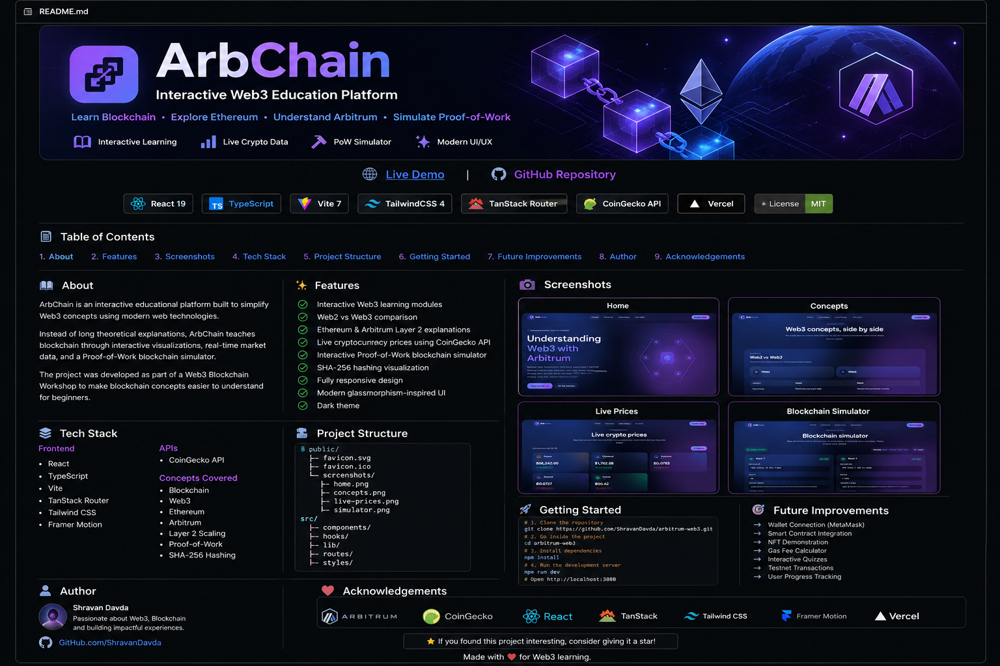
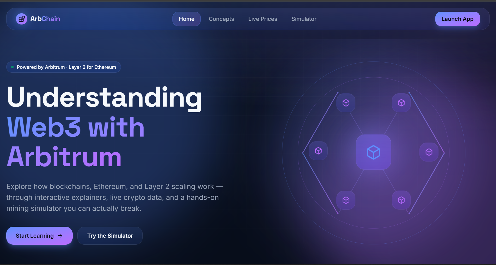
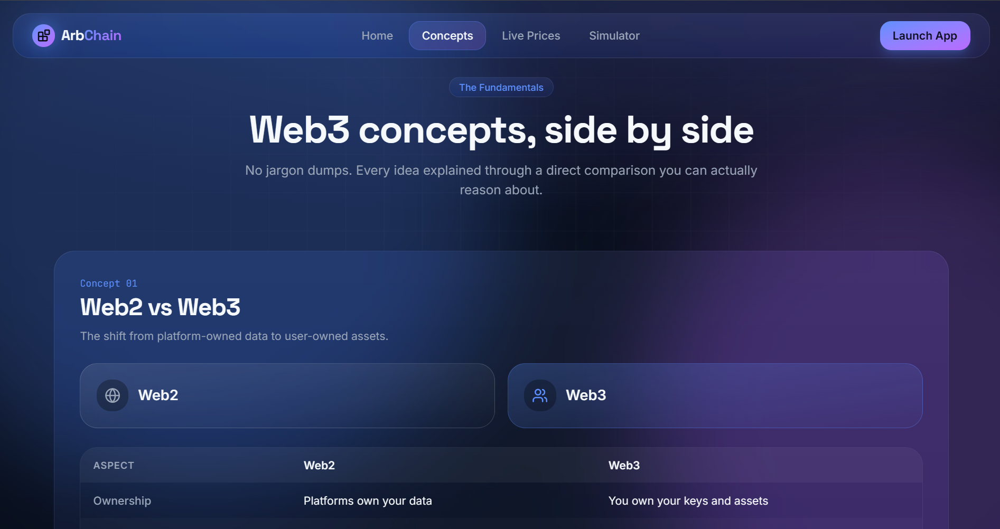
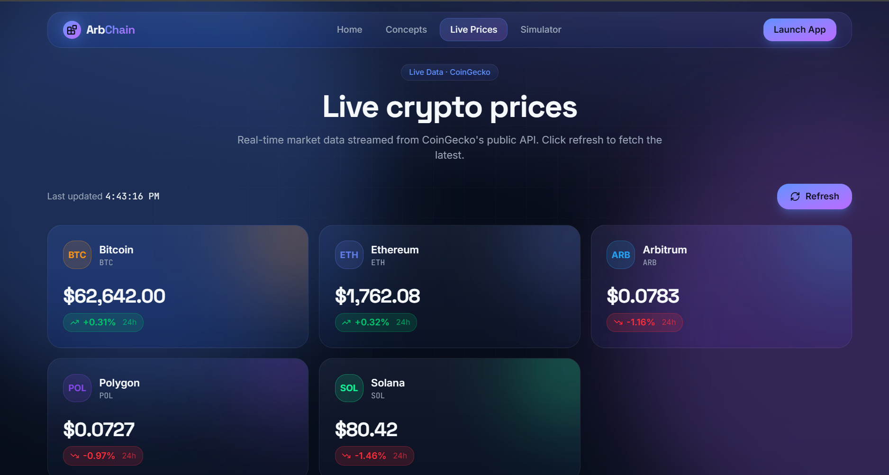
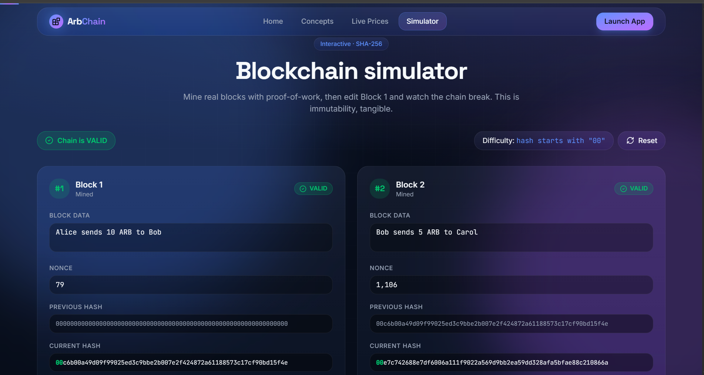

<p align="center">
  
</p>

<h1 align="center">
🚀 ArbChain
</h1>

<p align="center">
<b>An Interactive Web3 Learning Platform built around Arbitrum Layer 2.</b>
</p>

<p align="center">

<a href="https://arbitrum-web3.vercel.app">

</a>

<a href="https://github.com/ShravanDavda/arbitrum-web3">

</a>

</p>

---

# 🌟 Overview

**ArbChain** is an interactive educational platform that makes learning **Web3**, **Ethereum**, and **Arbitrum Layer 2** intuitive through visual explanations, real-time cryptocurrency data, and a hands-on blockchain simulator.

Rather than reading long documentation, users learn blockchain concepts by interacting with them.

Developed as part of a **Web3 Blockchain Workshop**, the project demonstrates both blockchain concepts and modern frontend engineering.

---

# ✨ Features

## 📚 Learn Web3 Visually

- Beginner-friendly explanations
- Interactive concept cards
- Modern UI with smooth animations

---

## ⚖️ Web2 vs Web3 Comparison

Understand the key differences between:

- Ownership
- Authentication
- Storage
- Trust
- Payments
- Governance

---

## ⛓ Learn Arbitrum Layer 2

Explore

- Ethereum scaling
- Rollups
- Layer 2 architecture
- Why Arbitrum exists
- Transaction flow

---

## 📈 Live Cryptocurrency Prices

Powered by the CoinGecko API.

Displays real-time prices of:

- Bitcoin
- Ethereum
- Arbitrum
- Polygon
- Solana

Includes

- 24-hour change
- Live refresh
- Market updates

---

## ⚡ Interactive Blockchain Simulator

A hands-on SHA-256 mining simulator where users can

- Edit transactions
- Mine blocks
- Observe Proof-of-Work
- Break blockchain integrity
- Restore chain validity

This provides an intuitive understanding of blockchain immutability.

---

# 🖼 Screenshots

## 🏠 Home

<p align="center">

</p>

---

## 📚 Concepts

<p align="center">

</p>

---

## 📈 Live Prices

<p align="center">

</p>

---

## ⚡ Blockchain Simulator

<p align="center">

</p>

---

# 🛠 Tech Stack

## Frontend

- React
- TypeScript
- Vite
- TanStack Router
- Tailwind CSS
- Framer Motion

## APIs

- CoinGecko API

## Deployment

- Vercel

---

# 📂 Folder Structure

```text
public/
│
├── favicon.svg
├── favicon.ico
└── screenshots/
    ├── banner.png
    ├── home.png
    ├── concepts.png
    ├── live-prices.png
    └── simulator.png

src/
│
├── components/
├── hooks/
├── lib/
├── routes/
├── styles/
└── assets/
```

---

# 🚀 Running Locally

Clone the repository

```bash
git clone https://github.com/ShravanDavda/arbitrum-web3.git
```

Move inside the project

```bash
cd arbitrum-web3
```

Install dependencies

```bash
npm install
```

Run development server

```bash
npm run dev
```

Open

```
http://localhost:3000
```

(or the port displayed by Vite)

---

# 🎯 Learning Outcomes

This project demonstrates

- Blockchain fundamentals
- Web3 architecture
- Ethereum ecosystem
- Arbitrum Layer 2
- Proof-of-Work
- SHA-256 hashing
- Blockchain immutability
- Real-time API integration
- Responsive frontend development

---

# 🚀 Future Improvements

- MetaMask wallet connection
- Smart contract integration
- NFT demonstration
- Token transfer simulator
- Gas fee visualizer
- Interactive quizzes
- User authentication
- Progress tracking
- Multi-language support

---

# 👨‍💻 Author

### Shravan Davda

GitHub

https://github.com/ShravanDavda

---

# 🙏 Acknowledgements

This project was inspired by the Web3 learning ecosystem and built using amazing open-source tools.

Special thanks to

- Arbitrum
- CoinGecko
- React
- TanStack Router
- Tailwind CSS
- Framer Motion
- Vercel

---

# ⭐ Support

If you enjoyed this project or found it useful, consider giving it a ⭐ on GitHub.

It helps others discover the project and supports future improvements.

---

<p align="center">

<b>Built with ❤️ for the Web3 community.</b>

</p>
